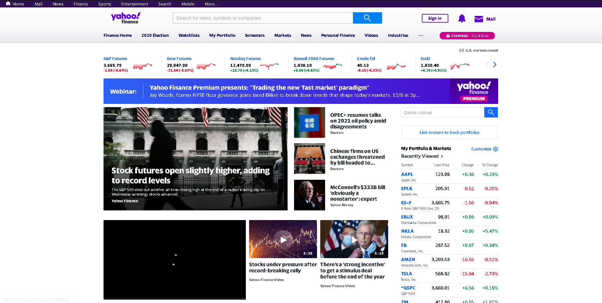
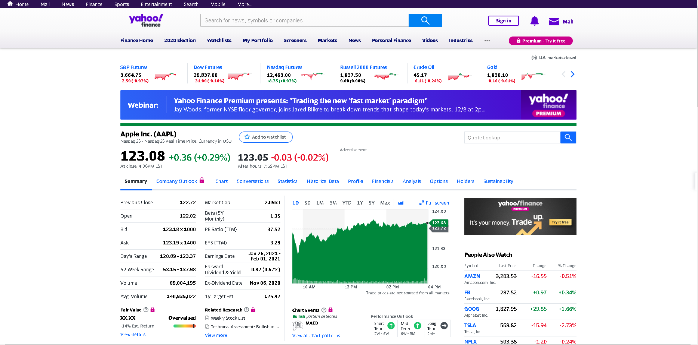
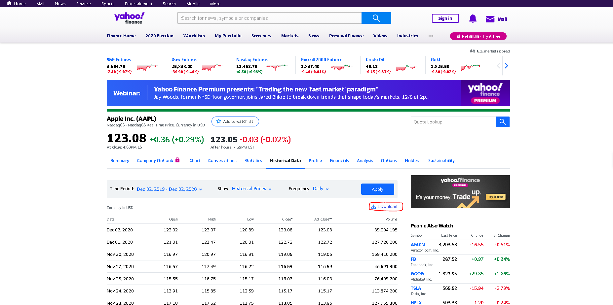

# Fuente de Datos

Para este proyecto de Big Data, se selecciono Yahoo Finance. Esta pagina provee historicos de comodities, bonos y  acciones de Estados Unidos. Cada una de las acciones esta respaldada por un historial el cual contiene la siguiente informacion: [Fecha, Valor inicial, Valor maximo, Valor minimo, Valor final, Volumen]. Con esta informacion se pueden hacer estudios y formular conjeturas las cuales pueden ser probadas y analizadas con herramientas como Apache Spark. [Link de Yahoo Finance.](https://finance.yahoo.com)

## Pagina Principal

## Ejemplo
###  Stock Apple (AAPL)

### Descarga de datos
