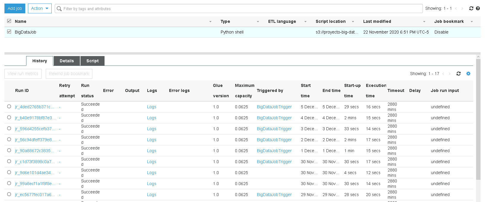
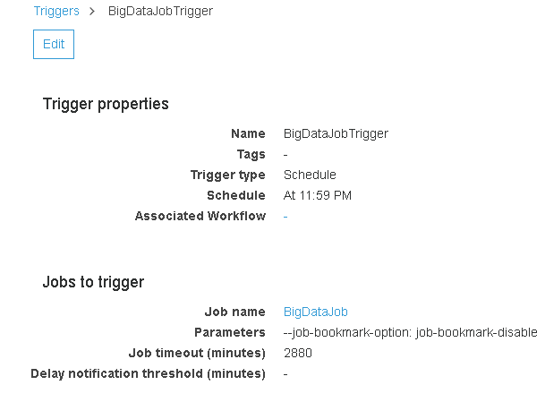
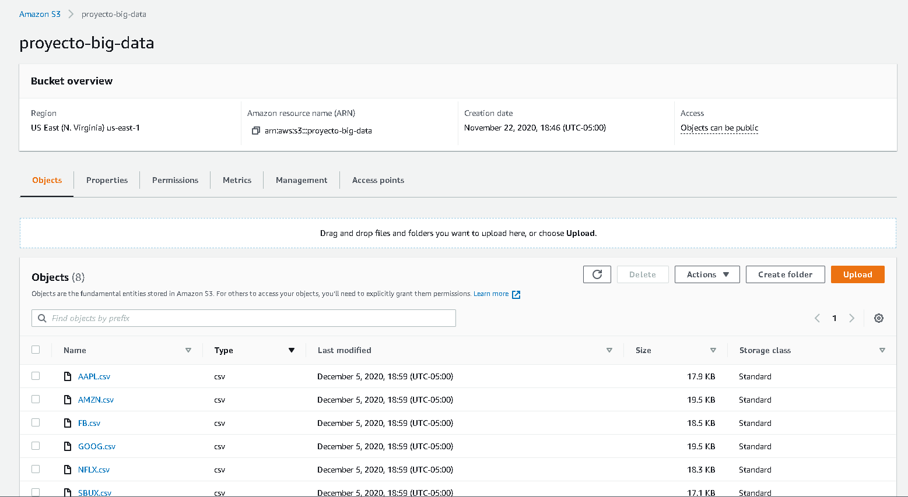

# Ingesta de Datos

Para la ingesta de datos se está usando AWS Glue. Glue es un servicio administrado por Amazon que permite hacer trabajos de extracción, transformación y carga de datos fácilmente.

## Job
Realiza la extracción y carga de datos.
Obtiene los datos de la API de YahooFinance y los carga a un bucket de S3.


```py
import requests
import boto3

urls = ["https://query1.finance.yahoo.com/v7/finance/download/AAPL?period1=1575156246&period2=1606778646&interval=1d&events=history&includeAdjustedClose=true",
        "https://query1.finance.yahoo.com/v7/finance/download/TSLA?period1=1575156299&period2=1606778699&interval=1d&events=history&includeAdjustedClose=true",
        "https://query1.finance.yahoo.com/v7/finance/download/AMZN?period1=1575156332&period2=1606778732&interval=1d&events=history&includeAdjustedClose=true",
        "https://query1.finance.yahoo.com/v7/finance/download/GOOG?period1=1575156449&period2=1606778849&interval=1d&events=history&includeAdjustedClose=true",
        "https://query1.finance.yahoo.com/v7/finance/download/NFLX?period1=1575156508&period2=1606778908&interval=1d&events=history&includeAdjustedClose=true",
        "https://query1.finance.yahoo.com/v7/finance/download/FB?period1=1575156529&period2=1606778929&interval=1d&events=history&includeAdjustedClose=true",
        "https://query1.finance.yahoo.com/v7/finance/download/SBUX?period1=1575157008&period2=1606779408&interval=1d&events=history&includeAdjustedClose=true"
        ]
s3_client = boto3.client('s3', region_name='us-east-1')

for url in urls:
    company = url.split('?')[0].split('/')[-1]
    r = requests.get(url=url)
    s3_client.put_object(
        Body=r.text, Bucket='proyecto-big-data', Key='{}.csv'.format(company))

```


## Trigger 
Permite correr el job en un intervalo de tiempo especificado. Esta programado para ejecutarse a la media noche.


### Resultados
Como resultado de correr BigDataJob, los siguientes archivos son creados en un balde de S3.


