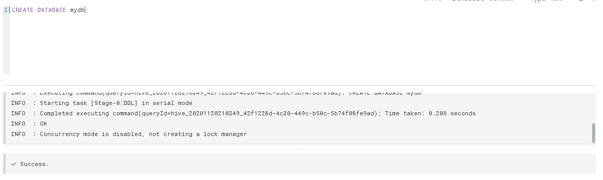
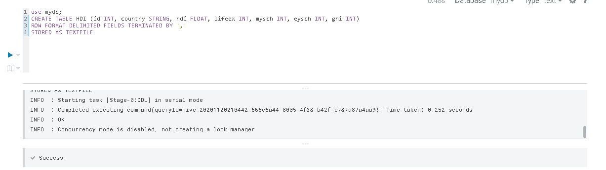
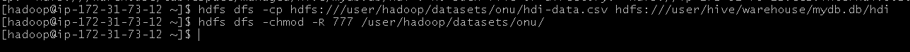
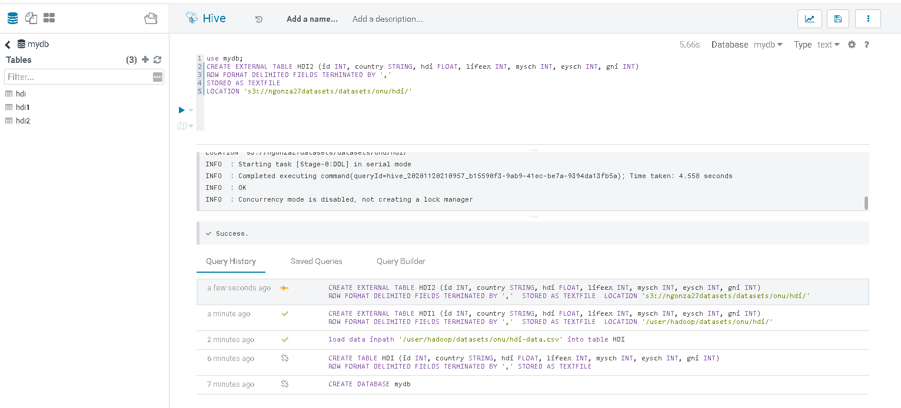
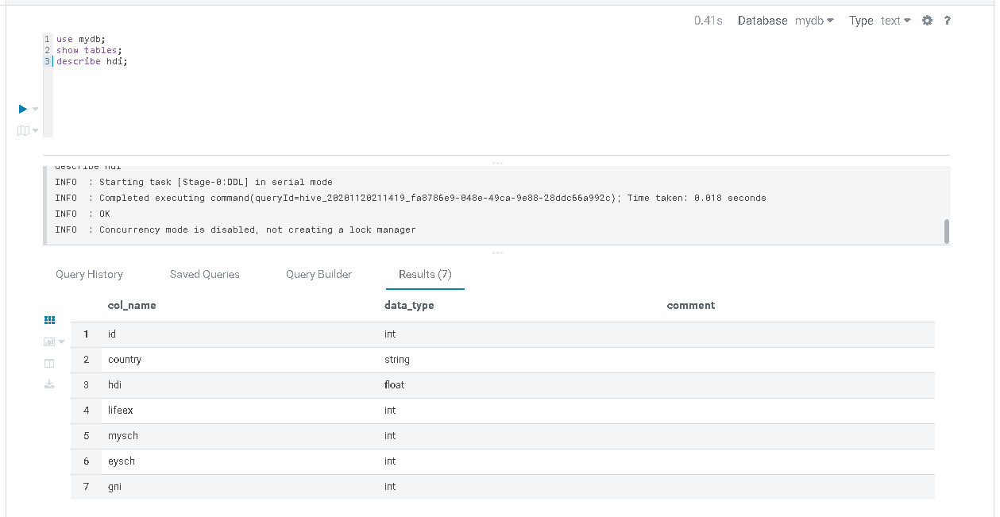
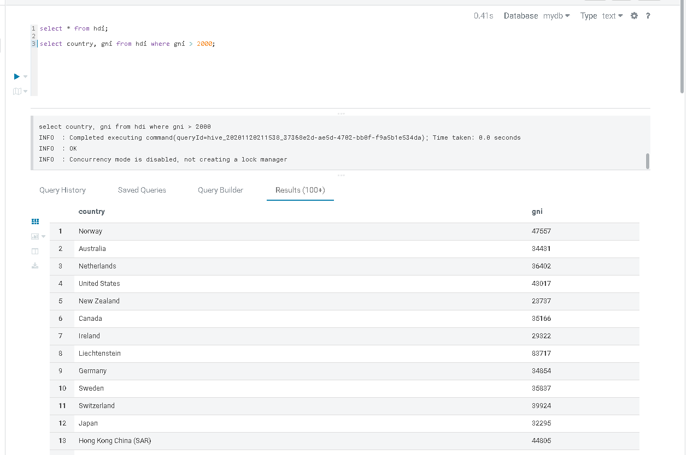
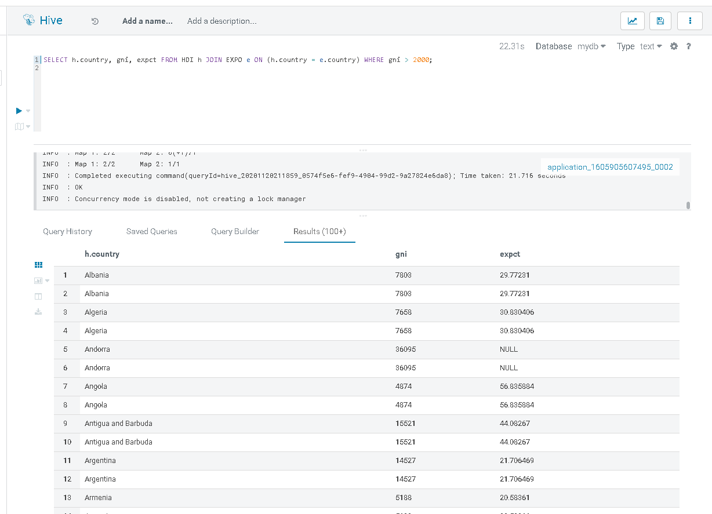
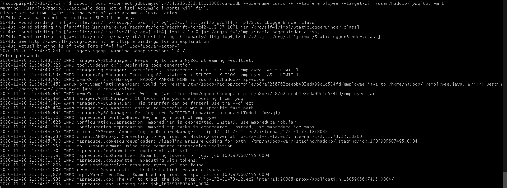

# Hive and Soop Lab
## Hive
## Crear base de datos en Hive
```
CREATE DATABASE mydb
```


## Crecion de Tabla
```
use mydb;
CREATE TABLE HDI (id INT, country STRING, hdi FLOAT, lifeex INT, mysch INT, eysch INT, gni INT) 
ROW FORMAT DELIMITED FIELDS TERMINATED BY ','
STORED AS TEXTFILE
```

## Carga de datos

Nota: Ejecutar los comandos de hdfs en el nodo master del cluster EMR
```
$ hdfs dfs -cp hdfs:///user/hadoop/datasets/onu/hdi-data.csv hdfs:///user/hive/warehouse/mydb.db/hdi
```

Permisos para hacer 'load data in path'
```
$ hdfs dfs -chmod -R 777 /user/hadoop/datasets/onu/

load data inpath '/user/hadoop/datasets/onu/hdi-data.csv' into table HDI
```

## Tabla externa en hdfs: 
```
use mydb;
CREATE EXTERNAL TABLE HDI1 (id INT, country STRING, hdi FLOAT, lifeex INT, mysch INT, eysch INT, gni INT) 
ROW FORMAT DELIMITED FIELDS TERMINATED BY ',' 
STORED AS TEXTFILE 
LOCATION '/user/hadoop/datasets/onu/hdi/'
```
## Tabla externa en S3: 
```
use mydb;
CREATE EXTERNAL TABLE HDI2 (id INT, country STRING, hdi FLOAT, lifeex INT, mysch INT, eysch INT, gni INT) 
ROW FORMAT DELIMITED FIELDS TERMINATED BY ',' 
STORED AS TEXTFILE 
LOCATION 's3://ngonza27datasets/datasets/onu/hdi/'
```
Nota: Se crearon 3 tablas diferentes, cada una populada de diferente maneras



## Validacion de las tablas creadas
```
use mydb;
show tables;
describe hdi;
```


## Consulta a la base de datos
```
select * from hdi;
select country, gni from hdi where gni > 2000;    


# Tabla secuandaria
use mydb;
CREATE EXTERNAL TABLE EXPO (country STRING, expct FLOAT) 
ROW FORMAT DELIMITED FIELDS TERMINATED BY ',' 
STORED AS TEXTFILE 
LOCATION 's3://ngonza27datasets/datasets/onu/export/'
```


## Hive JOIN
```
SELECT h.country, gni, expct FROM HDI h JOIN EXPO e ON (h.country = e.country) WHERE gni > 2000;
```


## Wordcount en Hive
```
use mydb;
CREATE EXTERNAL TABLE docs (line STRING) 
STORED AS TEXTFILE 
LOCATION 's3://ngonza27datasets/gutenberg-small/';

SELECT word, count(1) AS count FROM (SELECT explode(split(line,' ')) AS word FROM docs) w 
GROUP BY word 
ORDER BY word DESC LIMIT 10;
```

## Sqoop
## Transfiriendo datos desde base de datos hacia HDFS
```
$ sqoop import --connect jdbc:mysql://34.236.231.151:3306/cursodb --username curso -P --table employee --target-dir /user/hadoop/mysqlOut -m 1
```


## Listar archivos:
```
hdfs dfs -ls /user/username/mysqlOut
```
## Crear tabla HIVE a partir de definición tabla Mysql:
```
$ sqoop create-hive-table --connect jdbc:mysql://34.236.231.151:3306/cursodb --username curso -P --table employee --hive-database mydbhive --hive-table employee -m 1--mysql-delimiters
```

## Transferir datos de una base de datos (tipo mysql) hacia HIVE vía HDFS:
```
sqoop import --connect jdbc:mysql://34.236.231.151:3306/cursodb --username curso -P --table employee --hive-import --hive-database mydbhive --hive-table employee -m 1 --mysql-delimiters
```

Reto
¿cómo llenar una tabla con los resultados de un Query? por ejemplo, como almacenar en una tabla el diccionario de frecuencia de palabras en el wordcount?
